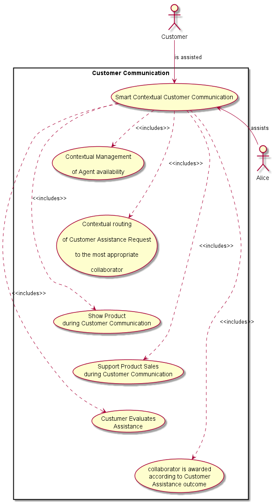

Smart Contextual Assistance Analysis
---------------------------

### User perspective

The Smart Contextual Assistance Apps automatically adapts its behavior according to Alice's context including location (office room or home room) context, activity and communication context. Two main Alice's context's are considered: Work context and Personal context.

Alice context can be derived from different sources including:

-	location
-	wearable devices including bracelet
-	communication parties
-	sensors in Alice's mobile
-	sensors in physical places where Alice is located
-	calendar
-	opened web documents

#### Work Context

In Work Context three main Use Cases are supported by the Smart Contextual Assistance app:

-	Smart Working provides Occupational safety and health features
-	Business Communication and Cooperation
-	Office Automation

##### Smart Working (Occupational safety and health)

While Alice is in a Work Context, Alice health and activity is continuously monitored through her bracelet for occupational safety and health purposes. Alice's personal data is collected according to applicable labor laws and she is able to fully control it.

Occupational safety and health doctors can remotely track Alice's health, giving advice and setting up remote occupational safety and health multimedia appointments to coach her.

##### Office Automation

When Alice context is "located in the Office" a few office automation features (see picture below) her available from the Smart Business Assistance app.

##### Business Communication

Alice context can also be set according to the communication party (see figure below), namely:

-	Customer Context: Alice is in a communication session with a Customer
-	co-worker Context: Alice is in a communication session with a co-worker
-	Partner Context: Alice is in a communication session with a Partner

On the other hand, according to the context status, the communication experience is adapted in order to make it as effective as possible, e.g. Alice Identity selection and associated user profile data, availability of communication features like video, etc.

Alice's communication experience is adapted according to Alice's context. For example:

-	in a customer context, only a small group of people can reach Alice including the customer account manager and her boss. The most relevant information about the customer history is highlighted in the UI according to conversation topic.

**Customer Context**

The Smart Contextual Assistance provides a Web Contact Center feature where each employee can play the role of the Agent for a previously scheduled slot. Thus, customer communication requests are routed to employees according to its Agent availability status. During Costumer conversations, the agent can display product related material and also sell products. At the end, Agent can be immediately awarded according to the outcome of the customer conversation.

The picture below depicts the different Customer Communication Use Cases.

**co-worker context**

In the co-worker context, besides the basic chat, audio and video features, the App also provides collaboration features like screen sharing and file transfer, which are organised according to the topic of the conversation which should be very much project oriented.

**partner context**

Similar to co-worker context. The big difference is that the organisation of sharable resources during the conversation depends on the related partnership project.

#### Personal Context

In Alice's Personal Context, three main use cases are supported:

-	smart living that uses a personal bracelet to support Alice's Wellbeing
-	Home Automation
-	Personal Communication

##### Home Automation

When Alice context is "located in her home" a few Home automation features (see picture below) her available from the Smart Personal Assistance app.

##### Smart Living

Alice health is continuously monitored through her bracelet and she follows a strict workout program to keep her in a good shape. Alice workout includes sessions in her gymnasium and outside her gymnasium (e.g. biking and running). Alice activity is continuously monitored by the App who also reminds her about workout activities to be performed. Alice's personal coach can remotely track Alice's performance, giving advice and setting up remote multimedia sessions to coach her (in a group or individually, according to subscribed workout program).

Workout Assistance App also enables her to meet and join other people following similar Workout programs. For example, during fitness sessions the App can also recommend to setup remote sessions at the same time and do fitness together as if they were in the same location. During these Do Remote Fitness Together Session, users can share in real time workout performance indicators in order to motivate each other.

Alice activity and health monitoring produce Alice Health Context and Alice Activity status inferred according to some AI algorithms.

##### Personal Communication

Alice's communication experience is adapted according to Alice's context, namely:

-	when training, only a small group of people can reach Alice including people from Alice's personal contact list and work contact list.
-	when training (or on the go), the focus is on voice user interface to handle communication (including ongoing communications).

Alice context can also be set according to the communication party including friends and relatives.

### Required Hyperties

The following Hyperties are required for the Smart Contextual Assistance scenario:

-	MyContacts Hyperty to handle a presence (context) enriched contact list.
-	[MyBracelet Hyperty](https://github.com/reTHINK-project/dev-hyperty/tree/master/docs/bracelet) which collects and publishes data from a bracelet
-	[MyContext Hyperty](https://github.com/reTHINK-project/dev-hyperty/tree/master/docs/myContext) which processes and infers context data from different context sources including from the Bracelet Hyperty
-	ContextualVoice Hyperty which extends a basic [Connector Hyperty](https://github.com/reTHINK-project/dev-hyperty/tree/master/docs/connector) to handle WebRTC based audio and video connections according to User's context
-	[Group Chat Hyperty](https://github.com/reTHINK-project/dev-hyperty/tree/master/docs/group-chat-manager) to provide Chat in a group of users
-	MyCoach Hyperty supports remote fitness sessions
-	MyFitness Buddy support workouts with remote fitness buddies
-	Room Hyperty support Home Automation features

