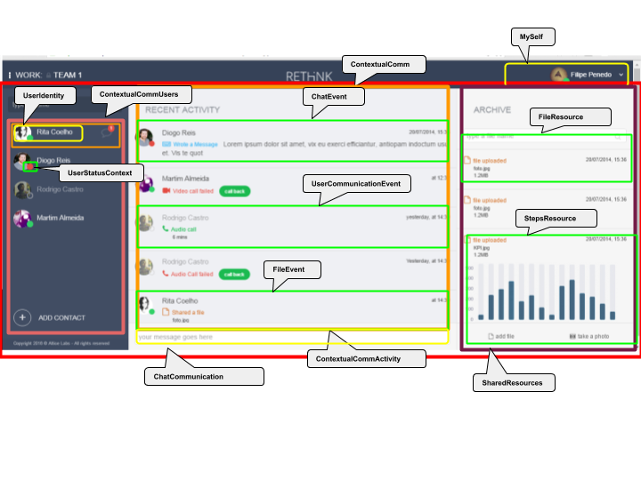
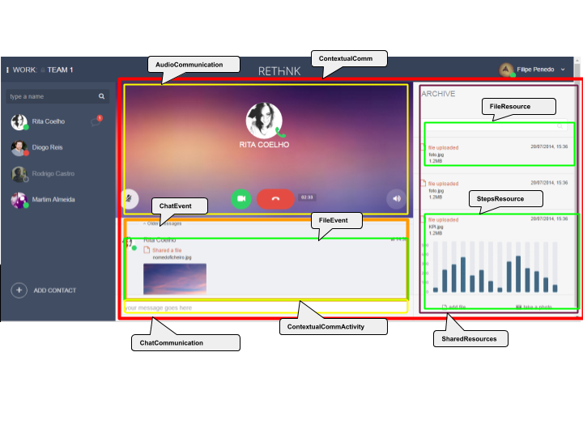
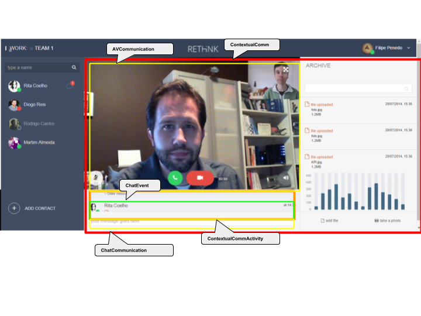

# Angular 2.0 implementation

This document describes the Application Architecture by using the Angular 2.0 framework.

In general, the Hyperty concepts are mapped into Angular concepts in the following way:

* Angular Service -> Hyperty
* Angular Model -> Hyperty Data Object
* Angular Observable Stream -> DataObjectObserver
* Angular Component with two levels of granularity:
 * one Angular Component per Data Object: Data Object Component
 * one Angular Component per Hyperty Resource : Hyperty Resource Component

The following sections describe how they are applied into the design of the App architecture.

## Angular Services

### App Specific

**ContextualData Service:** Generic Service to filter data according to the active context. It uses the Data Service.

**Data Service:** Generic Service that bridges Angular Observables and Hyperty Data Objects. It may use the reTHINK Storage Service for persistence purposes.

### Generic reTHINK Services

* Storage Service: it uses the Storage Manager

* Connector Service

* Chat Service (Group Chat Manager)

* Context Reporter Service

* Context Observer Service

* User Service : Identity Manager lib

* Discovery Service: Discovery lib

The Context and Observer Services can be further specialised eg:

* User Status Reporter Service
* User Status Observer Service
* Location Observer Service
* Location Reporter Service
* User Communication Reporter Service
* User Communication Observer Service

## Angular Module

### Angular reTHINK Core Models

Direct mapping between the data models described in json-schema and Angular Modules in typescript:

* Communication
* Connection
* Hyperty Resource
* User Identity
* Context (including ContextValue, ContextUnit, ContextUnitName, ...)

### Angular Models specific to the App

* ContextualComm
* ContextualCommTrigger

## Angular Components

### App Specific Angular Components

**CompositeContextualComm:** Context *tree* to be displayed on the left context panel

**ContextualCommUsers:** list of users to be displayed in the contacts panel

**ContextualComm:** with sub-component ContextualCommActivity: to be displayed in "RecentActivity". A ContextualCommActivity is composed by a list of `<HypertyResourceType>Event` sub-components (see below)

**SharedResources:** to be displayed in “Archive”. It is composed by `<HypertyResourceType>Resource` (see below)  

**MySelf:** to be displayed in right up corner

### reusable reTHINK Components

User-Identity (Identity and UserProfile class): to be used at least inside the following components:

* ContextualCommUsers

* ContextualCommActivity

* MySelf

* Communication: inside ContextualComm component

  We may have one sub-component per HypertyResource type supported by Communication - "<HypertyResourceType>Communication" - which is the component that handles with the view of communications using this type of resource. Examples:

  * ChatCommunication: component to handle with chat Communication

  * AudioCommunication: component to handle with audio Communication

  * AVCommunication: component to handle with Audio/video Communication

  * FileCommunication: component to handle with file sharing

* Context: inside ContextualComm component

  We may have one sub-component per HypertyResource type supported by Context - "<HypertyResourceType>Context" - which is the component that handles with the view of each type of Context. Examples:

  * UserCommunicationContext: component that handles with user communication context eg outgoing calls, lost calls, busy with ongoing calls, etc

  * UserStatusContext: Availability context type used at least inside the following components:

   * ContextualCommUsers
   * ContextualCommActivity
   * MySelf

  * LocationContext: handles with user location. It may include soma location view in maps eg google maps

  * StepsContext: handles with number of user steps and it may include some graphical view eg time evolution per hour, day, week ,etc

#### Hyperty Resource Type

There should be a "<HypertyResourceType>Resource" per "HypertyResourceType" to handle with the view of this resource in different ways including icons and the way it can be played during some ongoing communication (eg show a document during an ongoing video communication) or for a certain context (eg show User Steps performance graphic). Examples:

AudioResource: component to view audio resources including recorded audio calls or ongoing audio calls, depending in its status.

AVResource: components to view  audio-video resources including recorded av calls or ongoing av calls, depending in its status.

FileResource: component to view shared Files

PhotoResource: component to view shared Photos

StepsResource: component to view user Steps

UserCommunicationResource: component to view user communications history

For each "HypertyResourceType" there should be a "<HypertyResourceType>Event" component to handle with each event associated to this resource (to be mapped into “HypertyResource.content”). Examples:

- ChatEvent: component to handle with each chat event including chat message, "typing", etc

- UserCommunicationEvent: component to handle with each user communication activity event eg outgoing call, lost call, etc

- FileEvent: component to hanlde with file sharing events eg file received, file sent, removed file, etc

### Component layout

ContextualComm -> Context

ContextualComm -> Communication

ContextualComm -> ContextualCommActivities -> (inside this component are event related sub-components with different Hyperty Resources that are ordered according to its timing)

				-> ChatResourceEvent

				-> UserCommunicationResourceEvent

				-> FileResourceEvent

				-> UserActivityResourceEvent etc

## Angular Routes

The following Routes between components are defined:

Home (CompositeContextualComm)
- :context (ContextualComm)
- :task (ContextualCommActivity)

Params: `Home/:context/:task/:user/:type`

Example: `Home/Work/rethink/boldint@vitorsilva/chat | audio | video`

Home >
	Dashboard - contains a summary of all recent activities

Home > Work > reThink (activity screen)

  There is a "default" context where by default routes are directed to. In the  <ContextualCommUsers> "default" context, all contacts are loaded that are associated to this task/channel.

Home > Work > reThink > add

Route to add a contact to task / channel. It creates a new contact to the App.

Home > Work > reThink > <userId>

    > default (user screen) - When a chat is opened with <userId>

    > video (video screen) - When there is an ongoing AV Communication with <userId>

    > audio (audio screen) - When there is an ongoing Audio Communication with <userId>

## App Views

**App**

* Header Component
  * MySelf Componet
  * Rethink Logo
  * Breadcrumb Component
* ContextualComm  Component
 * Left
   * ContextualCommUsers Component
    * Search
    * ContextualCommUser
     * UserIdentity
     * UserStatusContext
     * Unread messages
 * Center
   * Activity Screen
   * User Screen
   * Audio Screen
   * Video Screen
 * Right
  * SharedResources Component
   * Search on components
   * FileResource Component
   * StepsResource Component

**Activity Screen**

* ContextualCommActivity Component
 * ChatEvent Component
 * UserCommunicationEvent Component
 * FileEvent Component
* ChatCommunication Component

**User Screen**

* UserInfo Component (info about the remote user and commands to setup audio and video communication)
* ContextualCommActivity Component
 * ChatEvent Component
 * UserCommunicationEvent Component
 + FileEvent Component
* Chat Communication Component

**Audio Screen**

* AudioCommunication Component
* ContextualCommActivity Component
 * ChatEvent Component
 * UserCommunicationEvent Component
 * FileEvent Component
* Chat Communication Component

**Video Screen**

* AVCommunication Component
* ContextualCommActivity Component
 * ChatEvent Component
 * UserCommunicationEvent Component
 * FileEvent Component
* Chat Communication Component
