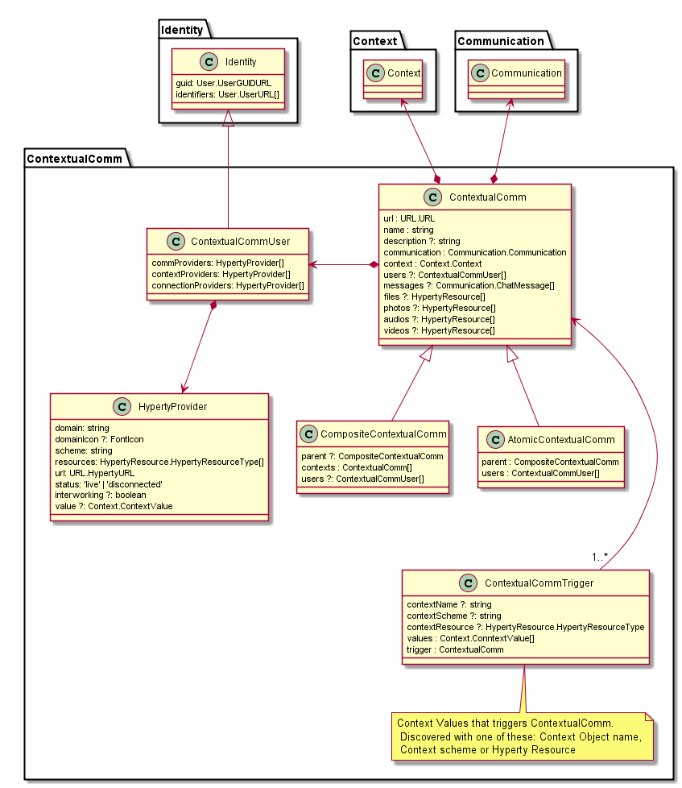

## Contextual Communication Data Model

The picture below depicts the Contextual Communication model used.
Each Contextual Communication session is characterised by a [Context data object]() and a [Communication Data Object]() that Hyperties use to manage context and communication in a integrated way.

Contextual Communications can be triggered by different Context values - ContextualCommTrigger - for example for certain location values. On the other side Contextual Communications are composite objects - CompositeContextualComm - organised in a tree structure, where the leaves are atomic objects - AtomicContextualComm.

The Application uses ContextName, ContextScheme and ContextResource defined by ContextualCommTrigger,  to discover and subscribe to Context Data Objects which will provide the data required to trigger the execution of each Contextual Communication session.

This model can be extended for specific Contexts like the Work Context as depicted below, where a tree of three layers is designed. Namely, the ContextualCommWork is the top root composite ContextualCommunication object comprised by ContextualCommWorkTask composite objects - i.e. represents work tasks - which have a set of ContextualCommWorkTaskUser atomic objects - i.e. represents users working in the task it belongs to.

As shown in the picture below, the ContextualCommWork class uses Context objects of type "Activity" that have different types of ContextValues including Location, Availability, UserCommunication and UserActivity.

### Convention names

The following conventions should be used by the App creating the Context and Communication Data Objects used:

1. All object names have an App prefix: `sca`  

2. Composite contexts and associated communication objects names are defined as `sca-<level1-context-name>-<level2-context-name>`. For example, a context communication for  "wp3" WorkTask inside a "rethink" Work, would be `sca-rethink-wp3`

2. Atomic contexts and associated communication objects names are defined as `sca-<level1-context-name>-<level2-context-name>..?<userId1>&<userId2>`. For example, a context communication for vsilva@boldint.com e and pchainho@gmail inside "wp3" WorkTask and "rethink" Work, would be `sca-rethink-wp3?vsilva@boldint.com&pchainho@gmail.com`

### Use Cases
*to be moved to a separated page dedicated to technical use cases?*

#### creation of new Contextual Comm

Before the creation of a new Contextual Comm the App will perform the following steps:

1. check locally if there is already an Contextual Comm with the same name.

2. otherwise, check with the Domain Registry if there are already Context and Communication with the same name. This step will imply a new Hyperty to query the DR (extend/reuse extending Discovery Hyperty from Quobis?), and can be skipped in the initial version.

3. if no Objects were found with the same name in 1) and 2), the object can be created.

#### invitation to join a new Contextual Comm

Before accepting the invitation to join a new Contextual Comm the App will check locally if there is already an Contextual Comm with the same name. If not, the invitation can be accepted.

#### invitation to join a Context or Communication from a different App

When invited to join a Context or Communication which name is not compliant with conventions defined above, this means the invitation is coming from a different App.

For the initial version:

1. App will check locally if there is already an Contextual Comm with the same name.

2. if not, the App creates a new top level Contextual Comm with prefix `nonsca`

Future versions can ask the user where to create the new Contextual Comm, giving suggestion where to create, taking account contexts where the users sending the invitation, is already present.
