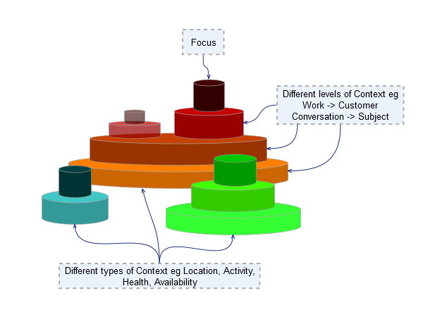
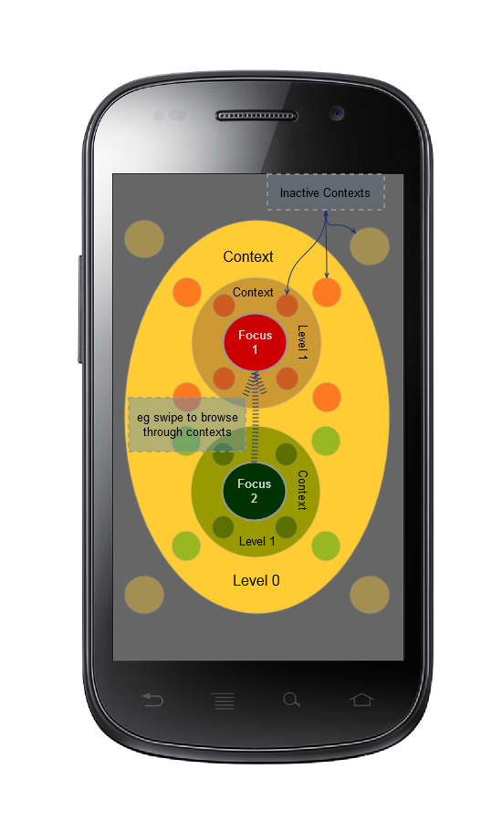
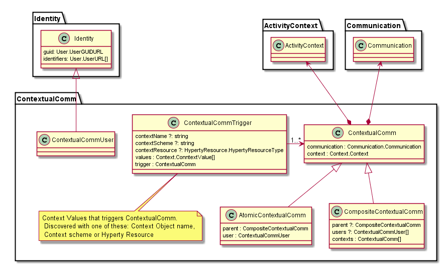
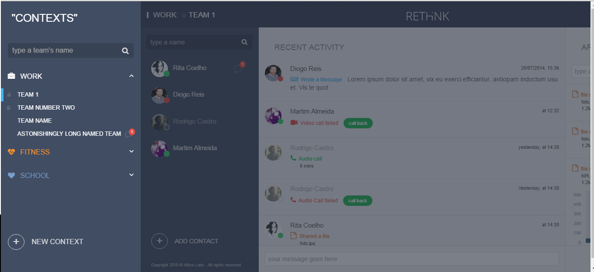
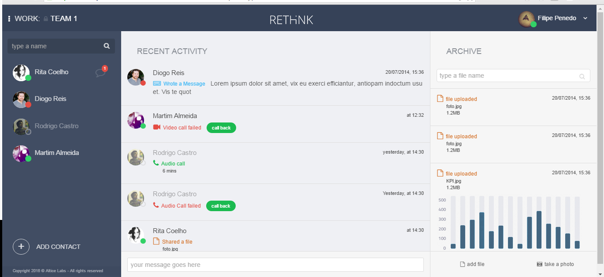
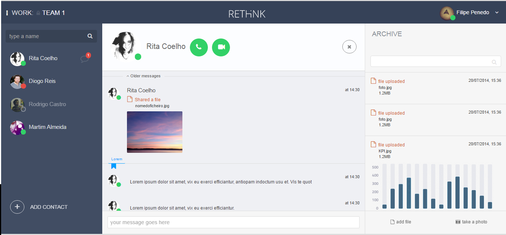
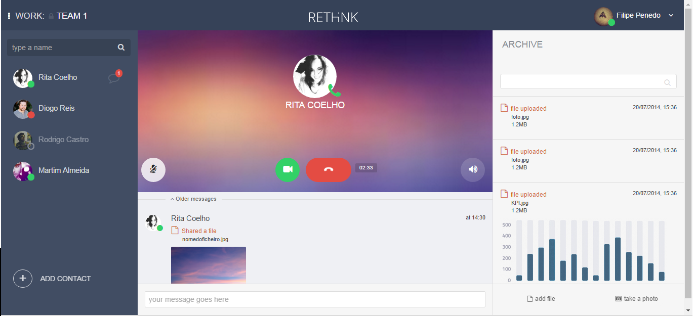
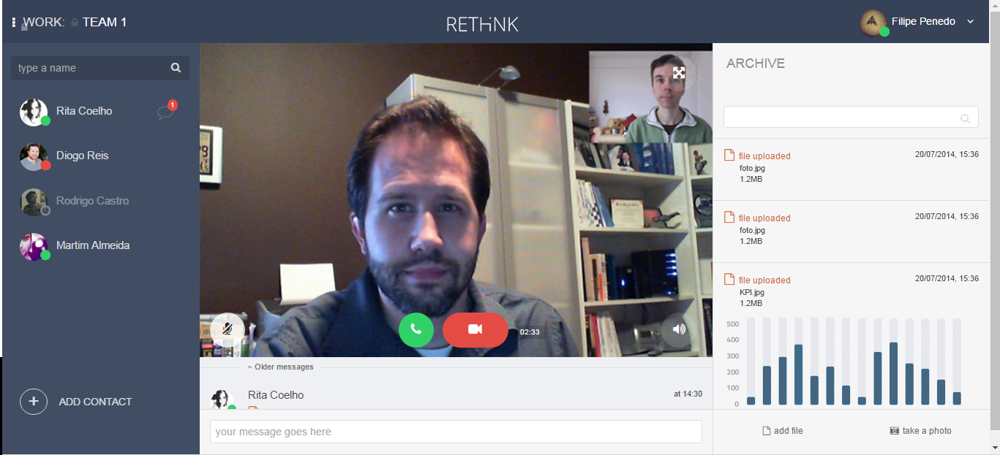

Smart Contextual Assistance Application
-------------------------------------

### Description

The Smart Contextual Assistance applications provides Contextual Communications and Connected Devices control. The user experience is automatically adapted according to user context in order to improve user focus and effectiveness. Thus, it behaves as a Smart Business Assistance app when the user is in a Work context or it behaves as a Smart Personal Assistance app when the user is in a Personal context. The Smart Business Assistance enables the user to collaborate with co-workers, external partners using other similar applications, as well as with customers. In addition, the Smart Business Assistance enables the user to control office rooms. The Smart Personal Assistance manages personal communications, enables the control of smart home devices and provides a personal wellness coach to assist user's wellbeing.

User's context can be derived from different sources including:

-	location
-	wearable devices including bracelet
-	communication parties
-	sensors in Alice's mobile
-	sensors in physical places where Alice is located
-	calendar
-	opened web documents

Currently the Application is designed to support Co-worker Business Conversation context and Personal Wellbeing context, using data collected from a connected Bracelet. The following Hyperties are used:

-	MyBracelet Hyperty to collect and publish data from a connected bracelet
-	User Status Hyperty to manage User availability context (presence status)
-	GroupChat Hyperty to support chat communication with group of users
-	Connector Hyperty to support Audio and Video communication with users

The picture below depicts the Context Concept landscape map view concept that will be researched in terms of User Interface design to express a User Context composed by different types of context (e.g. location, activity, availability, etc ) each one having different levels of detail (eg work -> Customer Conversation -> Subject).

Such context landscape view can be displayed in a 2D screen display as shown below. Browsing through the Context Landscape in touchscreen devices can be done with swipe gestures.

The picture below depicts the Contextual Communication model used.
Each Contextual Communication session is characterised by a [Context data object]() and a [Communication Data Object]() that Hyperties used to manage context and communication in a integrated way. On the other side Contextual Communications are composite objects - CompositeContextualComm - organised in a tree structure, where the leaves are atomic objects - AtomicContextualComm. Contextual Communications can be triggered by different Context values - ContextualCommTrigger - for example for certain location values.

The Application uses ContextName, ContextScheme and ContextResource defined by ContextualCommTrigger,  to discover and subscribe to Context Data Objects which will provide the data required to trigger the execution of each Contextual Communication session.

### [GUI Studies](gui-sketches.md)

### [Implementation with Angular 2.0](angular.md)

### User Journey

The user can explicitly select a certain context by clicking on top left side of the header and browse through the context tree.

By default, when the Work context is selected or automatically triggered, the Work Timeline is displayed, which contains:

-	A summary of shared work files.
-	the list of co-workers including its availability status
- last messages exchanged among co-workers.

When a specific Contextual Work Communication starts (eg when the user selects from the Context browser or a Work Activity Context is inferred by the App), the Team Work Context UI is activated, which contains:

-	Messages exchanged in the Team Work context.
-	an input form to write and send chat messages to Fitness Buddies
-	at the top the conversation subject and topic as well as commands to start audio or video communication.
-	files shared in the team
- button to share files

When a audio communication is started in a Work Peer context, the following actions and data is displayed:

-	Notification of new messages of other active Buddies
-	Icon to signal an on going audio conversation which can also be used to add video or close the conversation
-	at the bottom still an input form to write and send chat messages to Work Peer, as well as share files

Video Communication is also supported in a Work Peer Context:

